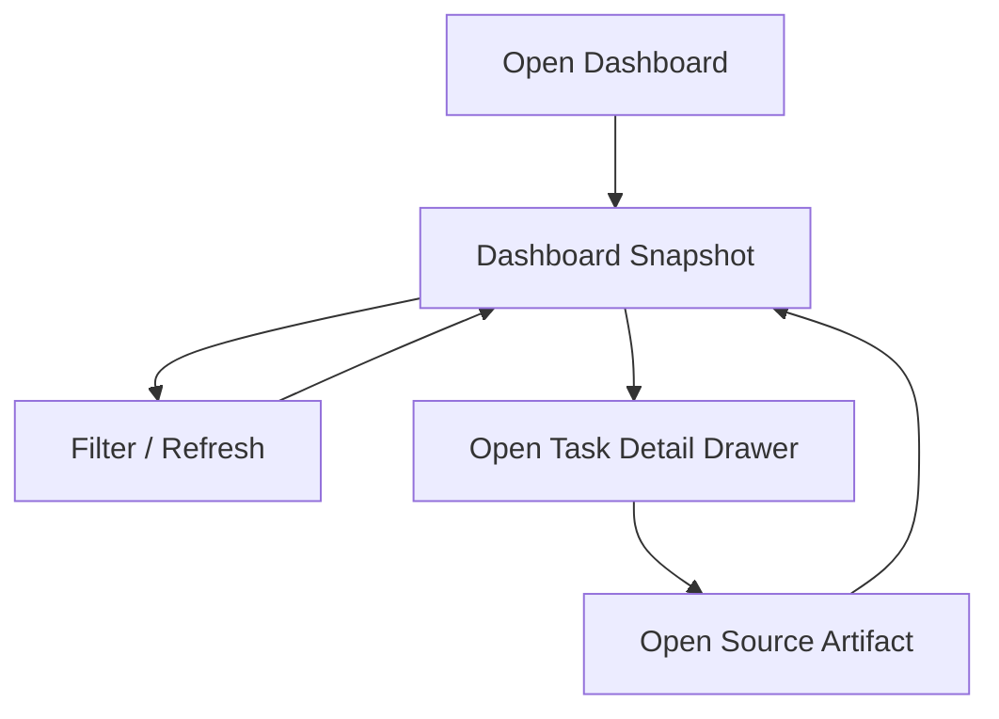

# UI Design

> UI/UX가 있는 프로젝트에서만 사용하는 설계 문서입니다.  
> UI 비대상 프로젝트라면 상단에 `Not required for this scope`를 기록하고 유지합니다.

## Quick Read
- 이번 범위의 UI 목표: 분산 artifact를 머릿속에서 조합하지 않고도 프로젝트 현재 상태를 한 화면에서 판단할 수 있는 `Project Monitor Web`을 설계한다.
- 현재 설계 대상 화면: single-screen dashboard + task/detail drawer
- 이번 문서에서 꼭 지켜야 할 흐름: 사용자는 먼저 한 화면에서 전체 상태를 파악하고, 필요할 때만 세부 drawer와 source artifact 링크로 들어간다.
- 금지된 UI 해석 또는 생략: 실시간처럼 보이는 가짜 애니메이션, inline edit, write action, raw log stream, decorative chart 추가
- 테스트 때 놓치면 안 되는 포인트: 수동 새로고침 semantics, blocker/gate 구분, source artifact 링크, team/solo/large 필터 동작
- 다음 역할이 읽어야 할 범위: `Current UI Scope`, `Must Preserve Interactions`, `Screen Specs`, `Developer Notes`

## Applicability
- Status: Required
- Reason: self-hosting 전용 별도 웹앱인 `Project Monitor Web` Phase 1을 구현하기 위한 UI artifact가 필요하다.
- Last Updated At: 2026-04-06 18:06

## Current UI Scope
- Current screen / route: `/` `Project Monitor Dashboard`, `Task Detail Drawer`
- Current design task IDs: `DSG-05`, `DEV-12`, `TST-04`
- Related implementation scope: `tools/project-monitor-web/*`, parser/projection output, `.agents/runtime/team.json`, mandatory artifact files

## Must Preserve Interactions
- 사용자는 화면 진입 시 현재 snapshot을 보고, `Refresh`를 눌렀을 때만 최신 artifact 상태를 다시 불러온다.
- 어떤 패널에서도 artifact를 직접 수정할 수 없다. 모든 편집은 source artifact 링크를 통해 기존 경로로 이동해서 수행한다.
- blocker/gate는 `user decision`, `manual test`, `environment gate`, `stale lock`을 구분해 보여준다.
- `solo`, `team`, `large/governed` 프로필과 owner/status 기준 필터가 가능해야 한다.
- empty/loading/error 상태는 "무엇이 없는가"와 "무엇을 확인해야 하는가"를 명확히 말해야 한다.

## Changelog
- [2026-04-06] Designer: `Project Monitor Web` Phase 1 single-screen dashboard와 detail drawer 구조를 승인 baseline에 맞춰 작성

## UX Goal
- 사용자는 첫 화면 30초 안에 현재 iteration, active task, blocker, 문서 건강, 팀 책임 구조를 파악한다.
- 사용자는 세부 문제가 보이면 drawer와 source artifact 링크를 통해 판단 근거를 바로 확인한다.
- UI는 "멋져 보이는 모니터"가 아니라 실제 운영 판단용 control board처럼 느껴져야 한다.

## Screen Map

| Screen / Route | Purpose | Entry Point | Exit / Next Action |
|---|---|---|---|
| `Project Monitor Dashboard` `/` | 프로젝트 전체 상태를 한 화면에서 판단 | 웹앱 진입 | 필터 변경, 수동 새로고침, detail drawer 열기, source artifact 링크 이동 |
| `Task Detail Drawer` overlay | 선택된 task / blocker / handoff의 근거를 확인 | 보드/블로커/활동 패널에서 항목 선택 | drawer 닫기, source artifact 링크 이동 |

## Navigation / Flow


## Screen Specs

### Project Monitor Dashboard
- Goal: 전체 프로젝트 상태를 한 화면에서 판단한다.
- Key components:
  `Header Snapshot Bar`
  `Profile / Owner / Status Filters`
  `Refresh Button`
  `Project Board`
  `Blocker / Approval Queue`
  `Recent Activity`
  `Document Health`
  `Team Directory`
- User actions:
  수동 새로고침
  프로필 필터 전환
  owner / status 필터 적용
  task / blocker / handoff 선택
  source artifact 링크 열기
- Empty / loading / error states:
  loading 시 마지막 성공 시각과 현재 로딩 상태를 분리해 표시
  empty 시 "표시할 항목 없음"과 "어떤 artifact가 비어 있는지"를 명시
  parse warning 시 전체 앱을 멈추지 않고 warning banner와 partial data를 함께 표시
- Validation rules:
  `Refresh` 전에는 화면이 갱신되지 않는다
  `Document Health` 패널은 Phase 1에서 validator를 직접 실행하지 않는다
  `Team Directory` 패널은 `solo`에서 registry가 없을 수 있음을 허용한다

### Task Detail Drawer
- Goal: 선택한 항목의 판단 근거를 빠르게 확인한다.
- Key components:
  `Task Summary`
  `Scope / Owner / Role`
  `Latest Handoff`
  `Related Blockers / Gates`
  `Source Links`
- User actions:
  drawer 열기/닫기
  source artifact 링크 열기
  related task 탐색
- Empty / loading / error states:
  detail source가 없으면 "source 없음"을 명시하고 drawer는 열어둔다
  파싱 경고가 있으면 해당 필드만 warning으로 표시한다
- Validation rules:
  detail drawer는 read-only다
  source 링크는 항상 절대 truth artifact를 가리킨다

## Component Hierarchy
```text
ProjectMonitorDashboard
  HeaderSnapshotBar
  FilterBar
  MainGrid
    ProjectBoardPanel
    BlockerQueuePanel
    RecentActivityPanel
    DocumentHealthPanel
    TeamDirectoryPanel
  TaskDetailDrawer
```

## Design Tokens
- Colors:
  `ink` deep charcoal
  `paper` warm gray
  `signal-green` completed / healthy
  `signal-amber` warning / pending
  `signal-red` blocked / failed
  `signal-blue` active / selected
- Typography:
  `IBM Plex Sans` for UI text
  `IBM Plex Mono` for task IDs, paths, timestamps
- Spacing:
  dense dashboard spacing with clear card boundaries
  desktop first but tablet width까지 collapse 가능한 grid
- Feedback / status styles:
  status pill은 텍스트와 색을 함께 사용
  warning banner는 panel-local과 page-global 두 수준으로 구분

## Accessibility / Localization
- 접근성 요구사항:
  키보드만으로 필터, refresh, drawer 열기/닫기가 가능해야 한다.
  색만으로 상태를 전달하지 않는다.
  panel heading과 table/board row에 명확한 label을 둔다.
- 다국어/로컬라이징 요구사항:
  운영 설명은 한국어를 기본으로 하되, task ID/path/role/status code는 영어를 유지할 수 있다.

## Developer Notes
- 구현 시 반드시 지켜야 할 interaction:
  manual refresh only
  no inline edit
  source artifact link-out first
  single-screen 판단 흐름 유지
- 테스트 시 꼭 확인할 UI 포인트:
  `solo`에서 `Team Directory` graceful fallback
  `team` / `large`에서 owner/approval/gate 표시
  parse warning이 있어도 partial rendering 유지
  stale lock과 user decision 대기 구분 표시
