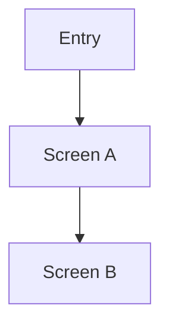

# UI Design

> UI/UX가 있는 프로젝트에서만 사용하는 설계 문서입니다.  
> UI 비대상 프로젝트라면 상단에 `Not required for this scope`를 기록하고 유지합니다.

## Quick Read
- 이번 범위의 UI 목표:
- 현재 설계 대상 화면:
- 이번 문서에서 꼭 지켜야 할 흐름:
- 금지된 UI 해석 또는 생략:
- 테스트 때 놓치면 안 되는 포인트:
- 다음 역할이 읽어야 할 범위:

## Applicability
- Status: Required / Not required for this scope
- Reason:
- Last Updated At: [YYYY-MM-DD HH:MM]

## Current UI Scope
- Current screen / route:
- Current design task IDs:
- Related implementation scope:

## Must Preserve Interactions
- [핵심 interaction 규칙]
- [핵심 validation 규칙]
- [핵심 empty/loading/error 규칙]

## Changelog
- [YYYY-MM-DD] Designer: initial draft

## UX Goal
- 사용자가 어떤 흐름으로 어떤 가치를 얻는가:

## Screen Map

| Screen / Route | Purpose | Entry Point | Exit / Next Action |
|---|---|---|---|
| [ScreenA] | [목적] | [진입] | [이동] |

## Navigation / Flow


## Screen Specs

### Screen A
- Goal:
- Key components:
- User actions:
- Empty / loading / error states:
- Validation rules:

### Screen B
- Goal:
- Key components:
- User actions:
- Empty / loading / error states:
- Validation rules:

## Component Hierarchy
```text
ScreenA
  Header
  Content
    Form
    ActionButton
```

## Design Tokens
- Colors:
- Typography:
- Spacing:
- Feedback / status styles:

## Accessibility / Localization
- 접근성 요구사항:
- 다국어/로컬라이징 요구사항:

## Developer Notes
- 구현 시 반드시 지켜야 할 interaction:
- 테스트 시 꼭 확인할 UI 포인트:
