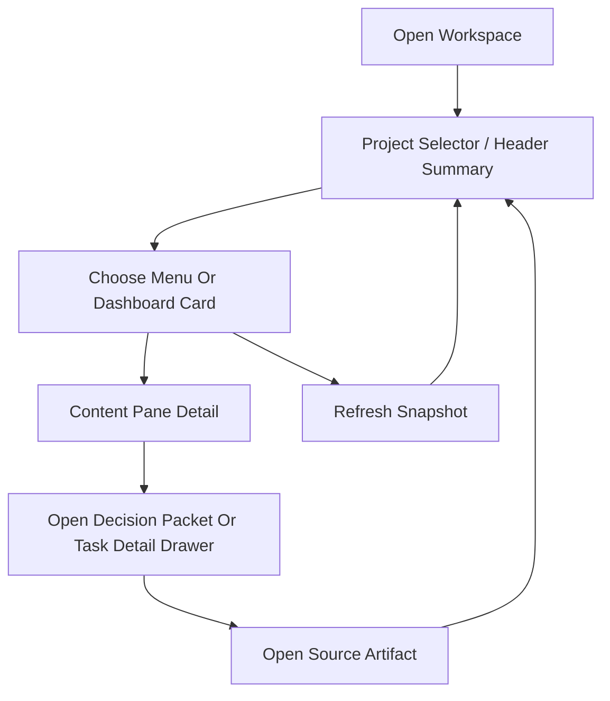

# UI Design

> UI/UX가 있는 프로젝트에서만 사용하는 설계 문서입니다.  
> UI 비대상 프로젝트라면 상단에 `Not required for this scope`를 기록하고 유지합니다.

## Quick Read
- 이번 범위의 UI 목표: 분산 artifact를 머릿속에서 조합하지 않고도 프로젝트 현재 상태와 승인 결정 맥락을 한 화면에서 판단할 수 있는 `Project Monitor Web`을 설계한다.
- 현재 설계 대상 화면: project selector가 있는 operator workspace + decision packet content pane + task/detail drawer
- current `CR-04` delta는 `Approval Queue -> 상세 결정 패킷`을 PMW 안에서 먼저 읽게 하는 방향으로 승인됐고, live PMW code에 반영됐다.
- 이번 문서에서 꼭 지켜야 할 흐름: 사용자는 먼저 상단 요약과 주요 카드에서 현재 결정을 파악하고, `Approval Queue`에서 선택한 항목의 decision packet을 우측 콘텐츠 영역에서 읽은 뒤 필요할 때만 drawer와 source link로 내려간다.
- 금지된 UI 해석 또는 생략: 실시간처럼 보이는 가짜 애니메이션, inline edit, write action, raw log stream, decorative chart 추가
- 테스트 때 놓치면 안 되는 포인트: 수동 새로고침 semantics, project selector context 분리, blocker/gate 구분, source artifact 링크, team/solo/large 필터 동작, decision packet 정보 압축 품질, launcher/stop affordance 경계
- 다음 역할이 읽어야 할 범위: `Current UI Scope`, `Must Preserve Interactions`, `Screen Specs`, `Developer Notes`

## Applicability
- Status: Required
- Reason: self-hosting 전용 별도 웹앱인 `Project Monitor Web` Phase 1을 구현하기 위한 UI artifact가 필요하다.
- Last Updated At: 2026-04-08 01:24

## Current UI Scope
- Current screen / route: `/` `Project Monitor Workspace`, `Task Detail Drawer`
- Current design task IDs: `DSG-05`, `DSG-06`, `DEV-03`
- Related implementation scope: `tools/project-monitor-web/*`, parser/projection output, `.agents/runtime/team.json`, mandatory artifact files

## Must Preserve Interactions
- 사용자는 화면 진입 시 현재 snapshot을 보고, `Refresh`를 눌렀을 때만 최신 artifact 상태를 다시 불러온다.
- 어떤 패널에서도 artifact를 직접 수정할 수 없다. 모든 편집은 source artifact 링크를 통해 기존 경로로 이동해서 수행한다.
- blocker/gate는 `user decision`, `manual test`, `environment gate`, `stale lock`을 구분해 보여준다.
- `solo`, `team`, `large/governed` 프로필과 owner/status 기준 필터가 가능해야 한다.
- empty/loading/error 상태는 "무엇이 없는가"와 "무엇을 확인해야 하는가"를 명확히 말해야 한다.

## Changelog
- [2026-04-06] Designer: `Project Monitor Web` Phase 1 single-screen dashboard와 detail drawer 구조를 승인 baseline에 맞춰 작성
- [2026-04-07] Planner: current PMW usability delta는 user feedback -> mockup -> implementation 순서로 다시 열고, current 화면 테스트 포인트를 design gate의 입력으로 유지했다.
- [2026-04-08] Planner: user feedback을 반영해 PMW를 밝은 operator workspace로 재구성하고, project selector / top summary / left navigation / top cards / content pane / artifact-aware overview를 low-fi wireframe에 추가했다.
- [2026-04-08] Planner: user 승인에 따라 `Project History` 전용 조회, top-bar `Exit`, launcher icon, stop icon을 approved PMW baseline에 추가했다.
- [2026-04-08] Planner: `CR-04` draft로 `Approval Queue -> 상세 결정 패킷` view를 추가하고, monitor에서 decision context를 먼저 읽는 흐름을 wireframe에 반영했다.
- [2026-04-08] Developer: approved wireframe을 기준으로 lighter workspace, project selector, overview/history/health/team views, decision packet content pane, local launcher/stop assets를 구현했다.

## UX Goal
- 사용자는 첫 화면 30초 안에 현재 iteration, active task, blocker, 문서 건강, 팀 책임 구조를 파악한다.
- 사용자는 세부 문제가 보이면 content pane, drawer, source artifact 링크를 통해 판단 근거를 바로 확인한다.
- UI는 "멋져 보이는 모니터"가 아니라 실제 운영 판단용 workspace처럼 느껴져야 한다.
- project overview는 `Product Goal`, `Open Questions`, requirements / architecture / implementation summary, recent history를 요약해 보여줘야 한다.
- approval packet은 사용자가 문서를 찾아다니지 않고도 `무엇을 결정해야 하는지`, `왜 지금 필요한지`, `어떤 선택지가 있는지`를 먼저 이해하게 해야 한다.

## Screen Map

| Screen / Route | Purpose | Entry Point | Exit / Next Action |
|---|---|---|---|
| `Project Monitor Workspace` `/` | 프로젝트 전체 상태를 상단 요약 + 메뉴 + 카드 + 콘텐츠 영역으로 판단 | 웹앱 진입 | project 전환, 메뉴 선택, 카드 클릭, decision packet 읽기, 수동 새로고침, detail drawer 열기, source artifact 링크 이동 |
| `Task Detail Drawer` overlay | 선택된 task / blocker / handoff의 근거를 확인 | 보드/블로커/활동 패널에서 항목 선택 | drawer 닫기, source artifact 링크 이동 |

## Navigation / Flow


## Information Architecture
- Top header:
  `Project Selector`
  `Project Name`
  `Goal Summary`
  `Current One-Line Status`
  `Next Action`
  `Refresh Snapshot`
  `Exit`
- Left navigation:
  `Project Overview`
  `Current State`
  `Project Board`
  `Task Detail`
  `Blocker / Approval Queue`
  `Recent Activity`
  `Project History`
  `Document Health`
  `Team Registry`
- Right top dashboard cards:
  `Current Stage`
  `Open Tasks`
  `Attention Queue`
  `Progress`
  `Current Agent`
  `Current Task`
  `Next Action`
  `Refresh Snapshot`
- Right bottom content pane:
  선택된 메뉴나 카드에 해당하는 detail content
  stage별 `기본 템플릿 + 특성화 템플릿` summary module
  approval packet summary and decision context
  artifact source link와 drawer entry point

## Local Shell Assets
- Directory:
  `tools/project-monitor-web`
- Required assets / entries:
  PMW launcher icon
  launcher entry that starts local server and opens PMW
  stop icon / stop entry for closing the local server process
- Shell boundary:
  launcher/stop entry는 self-hosting local convenience다.
  artifact/governance write action과 섞지 않는다.
  in-app top-bar `Exit`는 우선 app view close 의미로 해석하고, server stop은 별도 shell entry로 분리한다.

## Artifact Summary Sources
- `Project Overview`: `REQUIREMENTS.md > Product Goal`, `Open Questions`, requirements summary, `ARCHITECTURE_GUIDE.md` summary, `IMPLEMENTATION_PLAN.md` summary, `UI_DESIGN.md` mockup note, `PROJECT_HISTORY.md` recent items
- `Current State`: `CURRENT_STATE.md > Snapshot`, `Next Recommended Agent`, `Open Decisions / Blockers`
- `Project Board` / `Task Detail`: `TASK_LIST.md`, `IMPLEMENTATION_PLAN.md > Requirement Trace`
- `Blocker / Approval Queue`: `CURRENT_STATE.md`, `TASK_LIST.md`, optional `REVIEW_REPORT.md`, optional `DEPLOYMENT_PLAN.md`
- `Decision Packet`: `CURRENT_STATE.md > Open Decisions / Blockers`, `REQUIREMENTS.md > Open Questions / Pending Change Requests`, `IMPLEMENTATION_PLAN.md > Task Packet Ledger / Risks`, `PROJECT_HISTORY.md` recent context, `TASK_LIST.md > Blockers / Handoff`
- `Recent Activity`: `PROJECT_HISTORY.md`, `TASK_LIST.md > Handoff Log`
- `Project History`: `PROJECT_HISTORY.md` full timeline view with recent-first navigation
- `Document Health`: required artifact sync / parse health / optional runtime signal
- `Team Registry`: `.agents/runtime/team.json`, optional `governance_controls.json`

## Low-Fi Wireframe
```text
+--------------------------------------------------------------------------------------------------+
| [Project Selector v]  Project Name                     Goal Summary                 [Refresh] [Exit] |
| One-line status: "승인 큐의 결정 패킷 설계를 정리했고, 이제 사용자의 CR-04 승인을 기다린다."         |
| Next action: review decision packet layout + approve CR-04                                     |
+-------------------------+-----------------------------------------------------------------------+
| Left Menu               | Dashboard Cards                                                       |
|-------------------------|-----------------------------------------------------------------------|
| Overview                | [Current Stage] [Open Tasks] [Attention Queue] [Progress]            |
| Current State           | [Current Agent] [Current Task] [Next Action] [Document Health]       |
| Project Board           +-----------------------------------------------------------------------+
| Task Detail             | Content Pane                                                          |
| Blocker / Approval      | - Decision Packet: title / why now / recommendation / options        |
| Recent Activity         | - Current State: stage, focus, blocker, next agent                   |
| Project History         | - History: milestone / decision / implementation timeline            |
| Document Health         | - Board: filters + tasks + progress                                  |
| Team Registry           | - Blockers / Activity / Team / stage-specific summary module         |
+-------------------------+-----------------------------------------------------------------------+
| Detail Drawer (overlay): selected task / packet source / blocker / activity / source links       |
+--------------------------------------------------------------------------------------------------+
```

## Decision Packet Content Model
- Header:
  `Decision Title`
  `Decision Type`
  `Urgency / Gate`
  `Recommended Default`
- Context blocks:
  `Why This Matters Now`
  `Options And Impact`
  `Affected Tasks / Artifacts`
  `Recent History Context`
  `What Happens If Delayed`
  `Return To Codex Next Step`
- Source area:
  `Related Artifact Links`
  `Open In Drawer`
  `Open Source Artifact`

## Screen Specs

### Project Monitor Workspace
- Goal: 전체 프로젝트 상태를 workspace형 정보 구조로 판단한다.
- Key components:
  `Project Selector`
  `Header Summary`
  `Left Navigation`
  `Dashboard Cards`
  `Content Pane`
  `Decision Packet Panel`
  `Refresh Button`
  `Exit Button`
  `Project Board`
  `Blocker / Approval Queue`
  `Recent Activity`
  `Document Health`
  `Team Directory`
- User actions:
  project 전환
  메뉴 선택
  카드 클릭
  수동 새로고침
  프로필 필터 전환
  owner / status 필터 적용
  task / blocker / handoff 선택
  source artifact 링크 열기
  앱 종료 affordance 사용
  approval item 선택 후 decision packet 읽기
- Empty / loading / error states:
  loading 시 마지막 성공 시각과 현재 로딩 상태를 분리해 표시
  empty 시 "표시할 항목 없음"과 "어떤 artifact가 비어 있는지"를 명시
  parse warning 시 전체 앱을 멈추지 않고 warning banner와 partial data를 함께 표시
- Validation rules:
  `Refresh` 전에는 화면이 갱신되지 않는다
  `Document Health` 패널은 Phase 1에서 validator를 직접 실행하지 않는다
  `Team Directory` 패널은 `solo`에서 registry가 없을 수 있음을 허용한다
  project selector는 현재 project context를 항상 명시한다
  `Exit`는 artifact 편집 action과 시각적으로 분리된다
  launcher / stop icon은 top-bar `Exit`와 역할이 다르다는 점이 명확해야 한다
  decision packet은 read-only이며 승인 action button을 포함하지 않는다

### Task Detail Drawer
- Goal: 선택한 항목의 판단 근거를 빠르게 확인한다.
- Key components:
  `Task Summary`
  `Scope / Owner / Role`
  `Latest Handoff`
  `Related Blockers / Gates`
  `Source Links`
- User actions:
  drawer 열기/닫기
  source artifact 링크 열기
  related task 탐색
- Empty / loading / error states:
  detail source가 없으면 "source 없음"을 명시하고 drawer는 열어둔다
  파싱 경고가 있으면 해당 필드만 warning으로 표시한다
- Validation rules:
  detail drawer는 read-only다
  source 링크는 항상 절대 truth artifact를 가리킨다

## Component Hierarchy
```text
ProjectMonitorWorkspace
  ProjectSelectorBar
  HeaderSummaryBar
  LeftNavigation
  DashboardCardRow
  ContentPane
    OverviewPanel
    CurrentStatePanel
    ProjectBoardPanel
    BlockerQueuePanel
    DecisionPacketPanel
    RecentActivityPanel
    DocumentHealthPanel
    TeamDirectoryPanel
  TaskDetailDrawer
```

## Design Tokens
- Colors:
  `ink` soft slate
  `paper` warm white
  `mist` pale blue-gray
  `signal-green` completed / healthy
  `signal-amber` warning / pending
  `signal-red` blocked / failed
  `signal-blue` active / selected
- Typography:
  `IBM Plex Sans` for UI text
  `IBM Plex Mono` for task IDs, paths, timestamps
- Spacing:
  dense dashboard spacing with clear card boundaries
  desktop first but tablet width까지 collapse 가능한 grid
- Feedback / status styles:
  status pill은 텍스트와 색을 함께 사용
  warning banner는 panel-local과 page-global 두 수준으로 구분
  default theme는 dark-heavy가 아니라 밝은 작업 공간 톤을 사용

## Accessibility / Localization
- 접근성 요구사항:
  키보드만으로 필터, refresh, drawer 열기/닫기가 가능해야 한다.
  색만으로 상태를 전달하지 않는다.
  panel heading과 table/board row에 명확한 label을 둔다.
- 다국어/로컬라이징 요구사항:
  운영 설명은 한국어를 기본으로 하되, task ID/path/role/status code는 영어를 유지할 수 있다.

## Developer Notes
- 구현 시 반드시 지켜야 할 interaction:
  manual refresh only
  no inline edit
  source artifact link-out first
  project selector context separation
  workspace형 판단 흐름 유지
  launcher/stop shell affordance는 local process convenience로 제한
  approval queue는 목록에서 끝나지 않고 decision packet detail로 이어져야 한다
- 테스트 시 꼭 확인할 UI 포인트:
  `solo`에서 `Team Directory` graceful fallback
  `team` / `large`에서 owner/approval/gate 표시
  parse warning이 있어도 partial rendering 유지
  stale lock과 user decision 대기 구분 표시
  project selector 전환 시 다른 project 상태가 섞이지 않는지 확인
  decision packet first view만으로 recommendation / impact / source path를 이해할 수 있는지 확인
  launcher / stop entry와 top-bar `Exit` 의미가 혼동되지 않는지 확인
